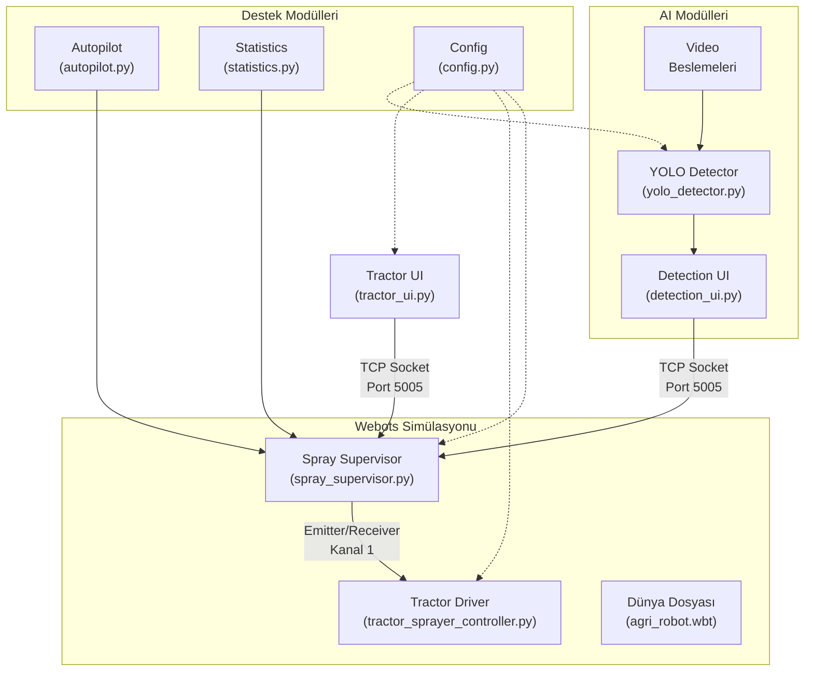
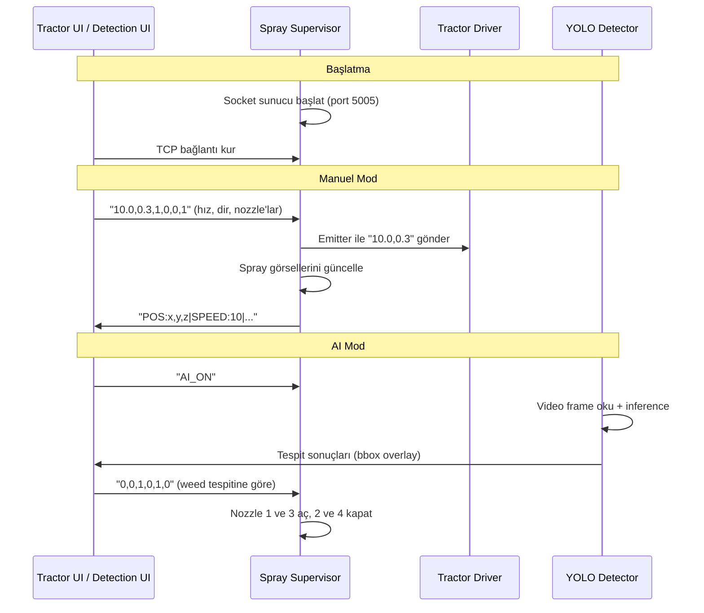

# 🚜 Akıllı Tarım İlaçlama Simülasyonu — Proje Raporu

**Proje Adı:** Yapay Zeka Destekli Hassas İlaçlama Simülasyonu  
**Tarih:** Şubat 2027  
**Platform:** Webots R2025a Robot Simülatörü  

---

## 1. Proje Özeti

Bu proje, bir traktörün arkasına monte edilen 4 nozzle'lı ilaçlama sisteminin yapay zeka ile entegrasyonunu simüle etmektedir. Temel hedef, YOLO modeli kullanarak yabancı ot ile bitki ayrımı yapılması ve yalnızca yabancı ot tespit edilen bölgelere ilaç uygulanmasıdır. Bu sayede gereksiz ilaç israfı azaltılarak hassas tarım (precision agriculture) konseptinin uygulanabilirliği gösterilmektedir.

### Temel Özellikler
- **4 Nozzle'lı Boom Sprayer** simülasyonu (her nozzle bağımsız kontrol)
- **YOLO tabanlı yabancı ot tespiti** (video beslemesi üzerinden)
- **Otonom sürüş modu** (PID kontrolcü ile sıra takibi)
- **İlaçlama istatistikleri** ve CSV dışa aktarım
- **Gerçek zamanlı kontrol UI** (Tkinter tabanlı)
- **Modüler mimari** (config.py ile merkezi ayar yönetimi)

---

## 2. Kullanılan Teknolojiler

| Teknoloji | Sürüm | Kullanım Alanı |
|-----------|-------|----------------|
| **Webots** | R2025a | Robot simülasyon ortamı |
| **Python** | 3.13+ | Tüm kontrolcü ve AI yazılımları |
| **YOLO (Ultralytics)** | v8+ | Yabancı ot / bitki sınıflandırma |
| **OpenCV** | 4.8+ | Video işleme, frame analizi, görselleştirme |
| **Tkinter** | Standart | Kontrol paneli ve tespit UI |
| **Pillow (PIL)** | 10.0+ | OpenCV ↔ Tkinter görüntü dönüşümü |
| **NumPy** | 1.24+ | Sayısal hesaplamalar |
| **TCP Socket** | Standart | Bileşen arası iletişim (UI ↔ Supervisor) |
| **VRML/PROTO** | Webots | 3D model tanımları (Sprayer, SandyGround) |

### Yazılım Mimarisi



---

## 3. Dosya Yapısı

```
agri_simulation/
│
├── config.py                          # Merkezi konfigürasyon dosyası
├── requirements.txt                   # Python bağımlılıkları
├── README.md                          # Proje hakkında bilgi
├── .gitignore                         # Git ignore kuralları
│
├── ai/                                # 🤖 AI / Yapay Zeka Modülleri
│   ├── yolo_detector.py               #   YOLO model wrapper + simülasyon modu
│   ├── detection_ui.py                #   4 kameralı tespit paneli (Tkinter + OpenCV)
│   └── videos/                        #   Kamera video dosyaları (kullanıcı ekler)
│       └── README.txt                 #   Video ekleme talimatları
│
├── controllers/                       # 🎮 Webots Kontrolcüleri
│   ├── spray_supervisor/              #   Ana kontrolcü (Supervisor yetkili)
│   │   ├── spray_supervisor.py        #     TCP sunucu, spray kontrol, AI entegrasyon
│   │   ├── weed_detector.py           #     Webots Recognition API (alternatif tespit)
│   │   ├── autopilot.py               #     PID otonom sürüş modülü
│   │   └── statistics.py              #     İlaçlama istatistik + CSV export
│   │
│   ├── tractor_sprayer_controller/    #   Traktör sürücü kontrolcüsü
│   │   ├── tractor_sprayer_controller.py  # Receiver ile hız/direksiyon uygulama
│   │   └── tractor_ui.py             #     Traktör kontrol paneli (Tkinter)
│   │
│   └── tractor_keyboard_controller/   #   Eski/alternatif kontrolcü
│       └── tractor_keyboard_controller.py # Doğrudan socket ile kontrol
│
├── protos/                            # 📦 Webots PROTO Tanımları
│   ├── Sprayer.proto                  #   4 nozzle'lı boom sprayer 3D modeli
│   ├── SandyGround.proto             #   Tarla zemin dokusu
│   ├── CropPlant.proto               #   Bitki PROTO (referans)
│   └── Weed.proto                    #   Yabancı ot PROTO (referans)
│
├── worlds/                            # 🌍 Webots Dünya Dosyaları
│   └── agri_robot.wbt                #   Ana simülasyon dünyası
│
└── ui/                                # 📱 Eski UI (referans)
    └── controller_ui.py               #   Eski kontrol paneli (artık kullanılmıyor)
```

---

## 4. Dosya Açıklamaları

### 4.1 Kök Dosyalar

#### `config.py` — Merkezi Konfigürasyon
Tüm modüllerin paylaştığı sabit değerleri tek bir yerde toplar. Bu sayede bir değer değiştirildiğinde tüm sisteme yansır.

```python
# ── Network ───────────────────────────────────────────────────────────
SOCKET_HOST = "localhost"
SOCKET_PORT = 5005

# ── Nozzles ───────────────────────────────────────────────────────────
NUM_NOZZLES = 4
NOZZLE_Y_OFFSETS = [-0.9, -0.3, 0.3, 0.9]   # traktör merkezine göre

# ── AI / YOLO ─────────────────────────────────────────────────────────
YOLO_MODEL_PATH = "models/best.pt"
YOLO_CONFIDENCE = 0.5
YOLO_CLASSES = ["weed", "crop"]

AI_VIDEO_PATHS = [
    "ai/videos/camera_1.mp4",   # Nozzle 1 — Sol Dış
    "ai/videos/camera_2.mp4",   # Nozzle 2 — Sol İç
    "ai/videos/camera_3.mp4",   # Nozzle 3 — Sağ İç
    "ai/videos/camera_4.mp4",   # Nozzle 4 — Sağ Dış
]
```

---

### 4.2 AI Modülleri (`ai/`)

#### `yolo_detector.py` — YOLO Tespit Wrapper

Bu modül YOLO modelini saran bir wrapper sınıf sunar. Model dosyası bulunamazsa otomatik olarak **simülasyon moduna** geçer (rastgele tespitler üretir).

**Temel sınıflar:**

```python
class Detection:
    """Tek bir tespit sonucu"""
    bbox: tuple        # (x1, y1, x2, y2) piksel koordinatları
    class_id: int      # 0 = weed, 1 = crop
    class_name: str    # "weed" veya "crop"
    confidence: float  # 0.0 - 1.0

class YOLODetector:
    """YOLO tabanlı tespit sınıfı"""
    def detect(frame) -> list[Detection]          # Frame'de tespit yap
    def draw_detections(frame, detections) -> frame  # Sonuçları çiz
    def has_weed(detections) -> bool               # Weed var mı?
```

**Gerçek YOLO Inference:**

```python
def _run_yolo(self, frame):
    results = self.model(frame, conf=self.confidence_threshold, verbose=False)
    for box in results[0].boxes:
        x1, y1, x2, y2 = box.xyxy[0].cpu().numpy().astype(int)
        class_id = int(box.cls[0].cpu().numpy())
        confidence = float(box.conf[0].cpu().numpy())
        # Detection nesnesi oluştur
```

#### `detection_ui.py` — 4 Kameralı Tespit Paneli

Tkinter + OpenCV hibrit UI. 4 video kaynağını eş zamanlı gösterir, her birinde YOLO tespiti yapar.

**Ana bileşenler:**
- `VideoPanel`: Tek kamera için video okuma + YOLO overlay
- `DetectionUI`: 2×2 grid düzeni + nozzle durumu + TCP bağlantı

```python
class VideoPanel:
    """Tek kamera paneli"""
    def open_video(path)          # Video aç
    def process_frame(ai_enabled) # Frame oku + YOLO çalıştır + göster
    
class DetectionUI:
    """Ana UI — 4 panel + kontroller"""
    def _update_loop()            # 33ms döngü (~30 FPS)
    def _toggle_ai()              # AI modu aç/kapat
    def _send_nozzle_states()     # Supervisor'a nozzle kararı gönder
```

---

### 4.3 Webots Kontrolcüleri (`controllers/`)

#### `spray_supervisor.py` — Ana Supervisor Kontrolcü

Projenin **beyni**. Supervisor yetkisiyle çalışır ve şunları yönetir:
- UI'dan gelen komutları alır (TCP socket sunucu)
- Spray görsellerini açar/kapatır (transparency)
- Yerde ilaçlama işaretleri bırakır
- Traktöre hız/direksiyon komutu gönderir (Emitter)
- AI ve Autopilot modüllerini koordine eder

**İletişim protokolü (UI → Supervisor):**

```
Komut formatı: speed,steering,n1,n2,n3,n4
Örnek:        10.0,0.3,1,0,0,1
              ↑     ↑   ↑ ↑ ↑ ↑
              hız  dir  nozzle durumları (0/1)

Özel komutlar:
  AI_ON          → Otomatik ilaçlama modu
  AI_OFF         → Manuel ilaçlama modu
  AUTOPILOT_ON   → Otonom sürüş başlat
  AUTOPILOT_OFF  → Otonom sürüş durdur
```

**Durum mesajı (Supervisor → UI):**

```
POS:x,y,z|SPEED:v|STEER:s|NOZZLES:n1,n2,n3,n4|MARKS:n|AI_MODE:m|DETECTIONS:d|STATS:...|AUTOPILOT:...
```

#### `autopilot.py` — Otonom Sürüş Modülü

PID kontrolcü ile zigzag sıra takibi yapar.

```python
class PIDController:
    """Direksiyon için PID kontrolcü"""
    kp = 2.5    # Oransal kazanç
    ki = 0.01   # İntegral kazanç
    kd = 0.8    # Türev kazanç

class Autopilot:
    # Durumlar: IDLE → DRIVING → TURNING → FINISHED
    def compute(tractor_pos, tractor_orientation):
        """Mevcut pozisyona göre hız ve direksiyon hesapla"""
        target_heading = atan2(dy, dx)         # hedef yön
        heading_error = target - current       # açı hatası
        steering = pid.compute(heading_error)  # PID çıkışı
        return speed, steering
```

**Waypoint üretimi (zigzag):**
```
Sıra 1: ──────→  (soldan sağa)
                  ↓ U-dönüş
Sıra 2: ←──────  (sağdan sola)
                  ↓ U-dönüş
Sıra 3: ──────→  (soldan sağa)
...
```

#### `statistics.py` — İlaçlama İstatistik Modülü

Her simülasyon adımında istatistikleri günceller ve CSV formatında dışa aktarır.

```python
class SprayStatistics:
    nozzle_active_steps = [0, 0, 0, 0]  # nozzle başına aktif adım
    weed_spray_steps = 0                # AI tetiklemeli ilaçlama
    manual_spray_steps = 0              # manuel ilaçlama
    route_points = []                   # rota GPS noktaları
    
    def export_csv(filepath)  # Simülasyon sonunda otomatik CSV kayıt
```

**CSV Çıktısı:**

| Metrik | Değer |
|--------|-------|
| Toplam Süre (s) | 120.5 |
| Toplam İlaçlama Süresi (s) | 34.2 |
| AI Verimlilik (%) | 78.5 |
| Nozzle N1 Aktif (s) | 8.3 |
| Nozzle N2 Aktif (s) | 12.1 |
| Nozzle N3 Aktif (s) | 6.7 |
| Nozzle N4 Aktif (s) | 7.1 |

#### `tractor_sprayer_controller.py` — Traktör Sürücü

Basit bir Vehicle.Driver kontrolcüsü. Supervisor'dan Receiver ile hız/direksiyon komutu alır ve uygular.

```python
# Receiver'dan son komutu oku
while receiver.getQueueLength() > 0:
    data = receiver.getString()
    parts = data.split(',')
    speed = float(parts[0])
    steering = float(parts[1])

# Driver'a uygula
driver.setCruisingSpeed(speed)
driver.setSteeringAngle(steering)
```

#### `tractor_ui.py` — Traktör Kontrol Paneli

Koyu temalı Tkinter UI. Direksiyon simidi görselleştirmesi, nozzle kontrolleri ve boom durumu gösterir.

**Özellikler:**
- 🎡 İnteraktif direksiyon simidi (canvas üzerinde)
- 📊 Boom sprayer görsel durumu
- 🤖 AI modu butonu
- 🚀 Otonom sürüş butonu
- 📈 Gerçek zamanlı istatistik gösterimi

---

### 4.4 PROTO Dosyaları (`protos/`)

#### `Sprayer.proto` — Boom Sprayer 3D Modeli

4 nozzle'lı ilaçlama boom'unun tam 3D tanımı. Her nozzle için:
- Spray görsel efekti (cone şeklinde)
- LED ışık göstergesi
- Bağımsız açma/kapama desteği

#### `SandyGround.proto` — Tarla Zemini

Kumlu tarla zemini doku tanımı. Gerçekçi toprak görünümü sağlar.

---

### 4.5 Dünya Dosyası (`worlds/`)

#### `agri_robot.wbt` — Ana Simülasyon Dünyası

Webots dünya dosyası. İçerir:
- 50m × 100m tarla alanı
- 10 adet bitki sırası (4m aralıklı)
- Traktör + Boom Sprayer
- Spray Supervisor robotu
- Gün ışığı ve arkaplan

---

## 5. İletişim Akış Diyagramı



---

## 6. Kurulum ve Çalıştırma

### Gereksinimler
1. **Webots R2025a** (veya üstü) kurulu olmalı
2. **Python 3.10+** kurulu olmalı

### Kurulum

```bash
# Proje dizinine git
cd agri_simulation

# Sanal ortam oluştur (isteğe bağlı)
python -m venv .venv
.venv\Scripts\activate    # Windows

# Bağımlılıkları yükle
pip install -r requirements.txt
```

### Çalıştırma

```bash
# 1. Webots'ta dünyayı aç
#    worlds/agri_robot.wbt dosyasını açın ve simülasyonu başlatın

# 2. Traktör kontrol panelini çalıştır
python controllers/tractor_sprayer_controller/tractor_ui.py

# 3. AI tespit panelini çalıştır (opsiyonel)
python ai/detection_ui.py
```

### YOLO Modeli Ekleme

```bash
# 1. Eğitilmiş model dosyasını kopyala
cp path/to/your/best.pt models/best.pt

# 2. config.py'de yolu güncelle (gerekirse)
YOLO_MODEL_PATH = "models/best.pt"

# 3. Video dosyalarını ekle
cp field_video_1.mp4 ai/videos/camera_1.mp4
cp field_video_2.mp4 ai/videos/camera_2.mp4
cp field_video_3.mp4 ai/videos/camera_3.mp4
cp field_video_4.mp4 ai/videos/camera_4.mp4
```

---

## 7. Gelecek Çalışmalar

| Öncelik | Özellik | Açıklama |
|---------|---------|----------|
| Yüksek | YOLO model eğitimi | Gerçek tarla görselleriyle weed/crop modeli |
| Yüksek | Gerçek video beslemesi | Tarla video datasetleri ile test |
| Orta | Değişken oranlı ilaçlama | Weed yoğunluğuna göre ilaç miktarı |
| Orta | Tank seviye simülasyonu | İlaç tüketimi takibi |
| Düşük | Web tabanlı dashboard | Gerçek zamanlı izleme paneli |
| Düşük | Rüzgar efekti | İlaçlama drift simülasyonu |

---

## 8. Sonuç

Bu proje, yapay zeka destekli hassas tarım ilaçlama konseptinin Webots simülasyon ortamında başarılı bir şekilde uygulanabileceğini göstermektedir. Modüler mimari sayesinde YOLO modeli değiştirilebilir, yeni sensörler eklenebilir ve sistem gerçek dünya uygulamalarına kolayca adapte edilebilir.

**Proje İstatistikleri:**
- Toplam Python dosyası: **10**
- Toplam PROTO dosyası: **4**
- Toplam kod satırı: **~3.500+**
- Bağımsız modül sayısı: **6** (supervisor, detector, autopilot, statistics, tractor_ui, detection_ui)
